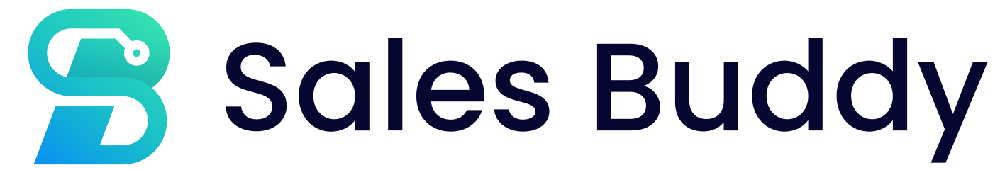

<p align="center">
  <picture>
    <source media="(prefers-color-scheme: dark)" srcset="static/logo-dark.svg" />
    <source media="(prefers-color-scheme: light)" srcset="static/logo.svg" />
    
  </picture>
</p>

A local-first productivity tool for Azure solution engineers and technical sellers. Unified customer views, call notes, revenue trends, milestones, and partner tracking - all in one place, running on your machine.


## Download

**[Download Sales Buddy Installer (Windows)](https://github.com/rablaine/SalesBuddy/releases/latest)**

The MSI installer handles everything: prerequisites (Git, Python, Azure CLI, Node.js), repo clone, environment setup, scheduled tasks, and server startup. Just run it.

## Features

- **Unified Customer View** - notes, engagements, milestones, opportunities, revenue, and partners on one page
- **Call Notes** - rich text editor with topic/seller/customer tagging, templates, and meeting import
- **Revenue Analyzer** - CSV import, trend charts, growth alerts, seller/customer/product drill-downs
- **Milestone Tracker** - visual board with MSX sync, task management, and AI matching from call notes
- **AI Assistant** - auto-suggest topics, match milestones, analyze calls, generate Connect summaries (Azure OpenAI)
- **WorkIQ Integration** - import Teams meeting summaries directly into notes
- **Partner Management** - directory with contacts, specialties, and real-time sharing between instances
- **Connect Export** - structured self-eval summaries over date ranges with per-customer breakdowns
- **Global Search** - full-text across notes, customers, sellers, topics, and territories
- **Analytics Dashboard** - activity heatmap, engagement trends, top topics and customers
- **Automatic Updates** - `update.bat` pulls latest code, migrates the database, and restarts
- **Daily Backups** - automatic OneDrive backup with daily/weekly/monthly retention

## Quick Start (Manual)

> If you installed via the MSI, skip to [First Run](#first-run).

```powershell
git clone https://github.com/rablaine/SalesBuddy.git C:\prod\SalesBuddy
cd C:\prod\SalesBuddy
start.bat
```

The launcher checks for prerequisites, offers to install anything missing via `winget`, creates the venv, and starts the server on `http://localhost:5151`.

<details>
<summary>Full manual setup</summary>

```powershell
git clone https://github.com/rablaine/SalesBuddy.git
cd SalesBuddy
python -m venv venv
.\venv\Scripts\Activate.ps1
pip install -r requirements.txt
copy .env.example .env
# Add a secret key to .env:
python -c "import secrets; print(secrets.token_hex(32))"
flask run
```

Visit `http://localhost:5151`. The database creates itself on first run.

</details>

## First Run

A setup wizard walks you through:

1. **Welcome** - overview and theme selection
2. **Azure login** - authenticate for MSX integration
3. **Import Accounts** - pull customer accounts from MSX
4. **Import Milestones** - sync milestone data from MSX
5. **Import Revenue** - upload an ACR CSV for the Revenue Analyzer

All steps are optional and can be re-run from the Admin Panel.

## AI Features

AI is powered by Azure OpenAI through a shared APIM gateway. No Azure OpenAI resource or env vars needed.

**Requirements:** Azure CLI + Microsoft corp account (`@microsoft.com`)

The setup wizard handles authentication. AI features work automatically for any Microsoft corporate account.

## WorkIQ (Meeting Import)

Import Teams meeting summaries into notes via [WorkIQ](https://github.com/nicklhw/workiq).

**Requirements:** Node.js 18+ (installed automatically by the launcher) and a Microsoft 365 Copilot license.

Two modes: **Import from Meeting** (summary only) and **Auto-fill** (summary + AI topic/milestone matching). The summary prompt is customizable globally or per-meeting.

## Updating

Double-click `update.bat`. It backs up the database, pulls latest code, installs new dependencies, runs migrations, and restarts. If anything fails, it rolls back automatically.

## Backups

Automatic daily backups to OneDrive with retention rotation (7 daily, 4 weekly, 3 monthly).

```powershell
.\scripts\backup.ps1 -Setup    # Configure OneDrive path + daily schedule
.\scripts\backup.ps1 -Status   # Show backup status
.\scripts\backup.ps1            # Backup now
```

Or use the Admin Panel for one-click backups.

## Scripts

| File | Purpose |
|------|---------|
| `start.bat` | Launch the server (auto-setup on first run) |
| `stop.bat` | Stop the server |
| `update.bat` | Pull updates, migrate, restart |
| `backup.bat` | Run a backup or configure automatic backups |
| `restore.bat` | Interactive restore from a backup |
| `uninstall.bat` | Remove scheduled tasks and stop server |

## Scheduled Tasks

| Task | Trigger | Purpose |
|------|---------|---------|
| `SalesBuddy-AutoStart` | At login | Start the server automatically |
| `SalesBuddy-DailyBackup` | Daily 11:00 AM | Back up database to OneDrive |

Remove with `uninstall.bat` or `scripts\uninstall.ps1`.

## Build the MSI

If you want to build the installer from source:

```powershell
# Prerequisites: .NET SDK 8.0+ and WiX v4
dotnet tool install -g wix

cd installer
.\build.ps1
# Output: installer\output\SalesBuddy.msi
```

See [installer/README.md](installer/README.md) for details.

## Running Tests

```powershell
pytest
pytest --cov=app tests/  # with coverage
```

## Documentation

| Guide | Description |
|-------|-------------|
| [MSX Integration](docs/MSX_INTEGRATION.md) | Account imports, milestone sync, API details |
| [WorkIQ Integration](docs/WORKIQ_INTEGRATION.md) | Meeting import setup and customization |
| [Connect Features](docs/CONNECT_FEATURES.md) | Self-eval export and impact signals |
| [App Insights](docs/APP_INSIGHTS.md) | Telemetry details and opt-out |
| [MSX Account Team Roles](docs/MSX_ACCOUNT_TEAM_ROLES.md) | Role definitions for account teams |

## Telemetry

Anonymous, aggregated feature usage data is sent to Application Insights. No personal data, customer names, or IP addresses are collected. See [App Insights](docs/APP_INSIGHTS.md) for details.

**Opt out:** Add `SALESBUDDY_TELEMETRY_OPT_OUT=true` to `.env` and restart.

## Compliance

The SQLite database is not encrypted at the application level. Encryption at rest is provided by BitLocker on your managed device. Must run on a Microsoft-managed, BitLocker-encrypted device. Do not copy the database to unmanaged or unencrypted storage.

## Uninstalling

**MSI install:** Use Add/Remove Programs in Windows Settings. Your database is preserved to `%TEMP%`.

**Manual install:** Run `uninstall.bat` to remove scheduled tasks, then delete the app folder. OneDrive backups are preserved.

## License

MIT - see [LICENSE](LICENSE) for details.

## Credits

Built by **Alex Blaine** ([@rablaine](https://github.com/rablaine)).

Thanks to **Ben Magazino** ([@SurfEzBum](https://github.com/SurfEzBum)) for testing, feedback, and helping shape the final product.

## Contact

For questions or suggestions, please open an issue on GitHub.
