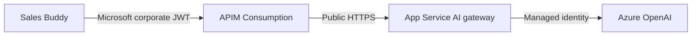
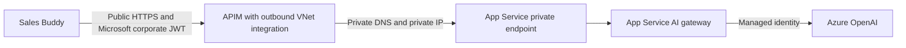

# Plan: Private AI Gateway Backend Networking

## Status

Contingency plan only. Do not implement unless governance confirms that Azure App Service must permanently use `publicNetworkAccess = Disabled`, or automated policy disables production access again.

## Incident Summary

On September 1, 2026, Azure Policy automation changed the production AI gateway App Service setting:

- Resource: `app-notehelper-ai`
- Property: `publicNetworkAccess`
- Previous value: `Enabled`
- New value: `Disabled`
- Change time: `2026-09-01T06:04:47.872Z`
- Policy assignment: `MCAPSGovDeployPolicies`
- Correlation ID: `5659033f-d743-4eed-a669-8a31819f1f10`

This broke the production request path because APIM Consumption calls the public App Service hostname and has no VNet route to a private endpoint.

Public access was manually restored while policy behavior is monitored.

## Current Architecture

Current networking facts:

- APIM tier: Consumption
- APIM VNet mode: None
- APIM production backend: `https://app-notehelper-ai.azurewebsites.net`
- App Service private endpoints: None
- App Service VNet integration: None
- Production and staging have separate public-network settings

## Trigger for Rearchitecture

Proceed only when at least one condition is met:

1. Governance confirms App Service public access must remain disabled.
2. Azure Policy disables production public access again.
3. A security review explicitly requires private connectivity between APIM and App Service.

If policy permits public access, retain current architecture and avoid additional APIM and Private Link cost.

## Target Architecture

Recommended baseline:

- Move APIM from Consumption to a tier supporting outbound VNet integration, likely Standard v2.
- Create dedicated APIM integration subnet.
- Create separate private-endpoint subnet.
- Create production App Service private endpoint.
- Create staging-slot private endpoint for canary validation.
- Create and link private DNS zone `privatelink.azurewebsites.net`.
- Keep APIM public inbound endpoint unless governance also requires private client ingress.
- Keep existing APIM JWT validation and gateway-secret controls.
- Set App Service public network access to `Disabled` only after private routing passes validation.

Confirm current Azure feature availability, regional support, pricing, and in-place APIM tier migration support before implementation.

## Implementation Plan

### Phase 1: Confirm Governance and Cost

1. Ask governance whether September 1 change was intentional and permanent.
2. Identify exact policy definition and required compliance deadline.
3. Confirm whether policy exemption is possible for APIM-backed App Service.
4. Compare Standard v2 cost against approved alternatives.
5. Confirm selected APIM tier supports required outbound VNet integration in deployment region.

### Phase 2: Build Private Network Path

1. Create or select VNet with non-overlapping address space.
2. Create dedicated APIM integration subnet using required delegation and network settings.
3. Create separate private-endpoint subnet with appropriate private-endpoint policies.
4. Integrate APIM with VNet for outbound backend connectivity.
5. Create App Service private endpoint for staging first.
6. Create private DNS zone `privatelink.azurewebsites.net`.
7. Link private DNS zone to APIM VNet.
8. Verify normal staging hostname resolves to private IP from APIM network path.

### Phase 3: Validate Staging

1. Keep staging public access enabled during initial setup.
2. Confirm APIM staging route reaches staging through private endpoint.
3. Disable staging public access.
4. Verify `/health` through APIM.
5. Run authenticated Auto-tag request using Microsoft corporate account.
6. Test all gateway endpoints used by Sales Buddy.
7. Verify Socket.IO partner sharing separately because it currently connects directly to App Service rather than through APIM.
8. Confirm deployment and SCM/Kudu access still work with selected deployment method.

### Phase 4: Migrate Production

1. Create production private endpoint.
2. Confirm production DNS resolves privately from APIM path.
3. Validate APIM-to-production health while public access remains enabled.
4. Disable production public access.
5. Verify APIM health and authenticated AI calls.
6. Monitor App Service, APIM, Azure OpenAI, and application diagnostics.

### Phase 5: Harden and Document

1. Add infrastructure as code for APIM tier, VNet, subnets, private endpoints, DNS, and links.
2. Document production and staging deployment procedures.
3. Add monitoring for App Service `publicNetworkAccess` changes.
4. Add alerting for APIM backend `403`, `502`, and `503` responses.
5. Update gateway deployment instructions with private-network validation steps.
6. Record recurring APIM and Private Link cost.

## Important Design Risks

### Partner Sharing

Partner sharing uses Socket.IO directly against App Service because current APIM configuration does not proxy that connection. Disabling App Service public access will break remote partner sharing unless it receives a separate reachable architecture.

Options to evaluate:

- Move Socket.IO traffic through a compatible APIM tier and API configuration.
- Use Azure Web PubSub or another managed real-time service.
- Split partner sharing into a separate public service with appropriate authentication.
- Retire remote sharing if no longer required.

Do not disable production public access permanently until this dependency is resolved.

### Deployment Access

Private App Service networking can affect deployment endpoints. Validate OneDeploy, SCM/Kudu, startup, and slot operations before production cutover. A private deployment agent or alternate deployment path may be required.

### DNS

Private Endpoint routing depends on correct DNS. APIM must resolve the normal App Service hostname through `privatelink.azurewebsites.net` to the private IP. Incorrect DNS can produce public routing, `403`, or backend connection failures.

### Slot Isolation

Production and staging slots require independent validation. Confirm exact private-endpoint subresource and DNS behavior for each slot before creating resources.

### Tenant Separation

Use accounts for distinct purposes:

- Gateway infrastructure owner account: Azure resource configuration only. Gateway calls from this tenant are expected to return `403`.
- Microsoft corporate account: authenticated Sales Buddy gateway calls and runtime validation.

Never use an owner-account gateway `403` as a service-health signal.

## Validation Checklist

- [ ] Governance requirement confirmed
- [ ] Cost approved
- [ ] APIM tier and regional support confirmed
- [ ] APIM outbound VNet integration operational
- [ ] Private DNS resolution verified
- [ ] Staging private endpoint operational
- [ ] Staging works with public access disabled
- [ ] Authenticated Auto-tag works through staging
- [ ] Partner sharing architecture resolved
- [ ] Deployment path validated
- [ ] Production private endpoint operational
- [ ] Production works with public access disabled
- [ ] Monitoring and alerts enabled
- [ ] Infrastructure and runbook documentation updated

## Rollback

If private routing fails during migration:

1. Re-enable App Service public network access if governance permits temporary rollback.
2. Keep APIM backend on existing App Service hostname.
3. Remove or disconnect VNet integration only after public routing is confirmed healthy.
4. Verify direct and APIM `/health` responses.
5. Validate authenticated AI calls with Microsoft corporate account.

Do not add application-level failover from production to staging. Production and staging must remain explicit infrastructure environments.
